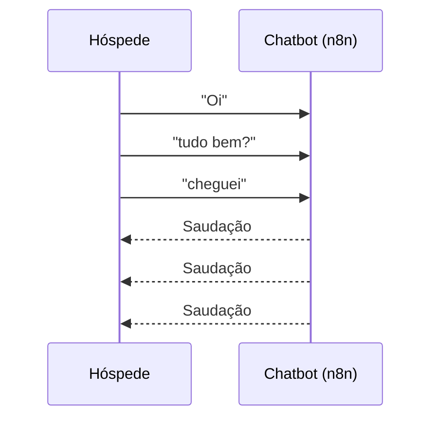
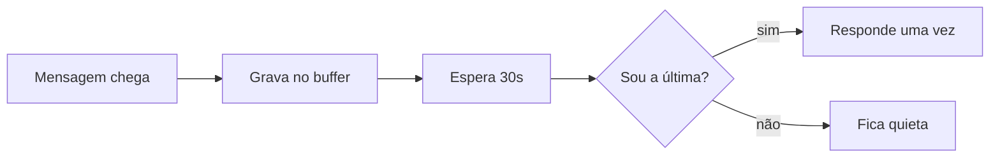

# Fluxo: antes e depois

## Antes (com o problema)

```mermaid
sequenceDiagram
    participant H as Hóspede
    participant N as Chatbot (n8n)
    H->>N: "Oi"
    H->>N: "tudo bem?"
    H->>N: "cheguei"
    N-->>H: Saudação
    N-->>H: Saudação
    N-->>H: Saudação
```

## Depois (com o buffer)

```mermaid
flowchart LR
    A[Mensagem chega] --> B[Grava no buffer]
    B --> C[Espera 30s]
    C --> D{Sou a última?}
    D -- sim --> E[Responde uma vez]
    D -- não --> F[Fica quieta]
```